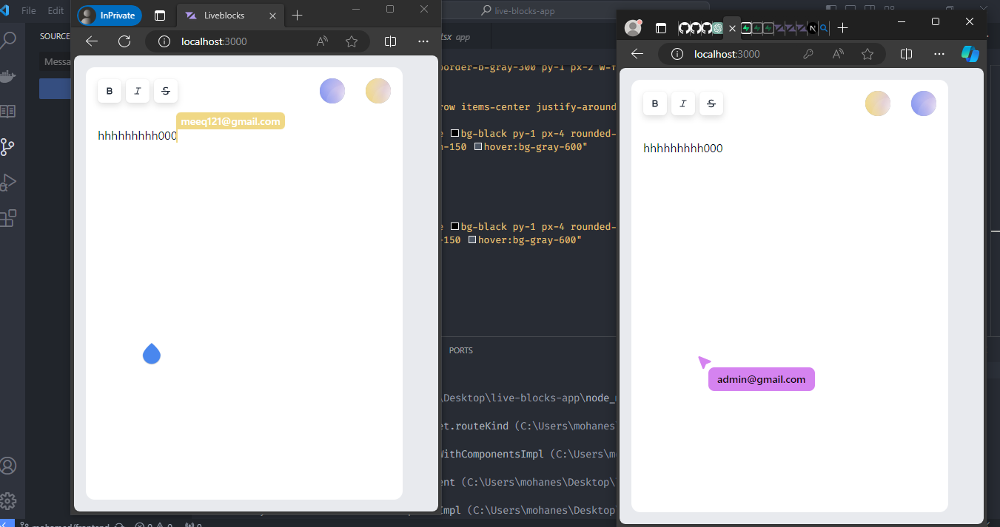

# Next.js App with Liveblocks

## Overview

This Next.js web application combines collaborative real-time editing features powered by Liveblocks with user authentication provided by Supabase. The app includes a login and register page for user authentication and a collaborative text editor with cursor tracking for real-time editing.

## Features

- **User Authentication**: The app features a user authentication system powered by Supabase, allowing users to register and log in securely.

- **Collaborative Text Editor**: Utilizing Liveblocks, the app includes a collaborative text editor where multiple users can simultaneously edit a shared document in real-time. Cursor tracking ensures users can see the position of others within the document.

- **Cursor tracking**: Cursor tracking ensures users can see the position of others within the document.
- **User Presence Indicators**: Shows the active users on document and on cursors (shows the email).
- **Mobile-Friendly Interface**: simple, beautiful mobile interface.

## Pages

### Login Page and Register Page

The login page allows existing users to log in to the application using their credentials or to create an account by providing necessary details such as email and password. It is integrated with Supabase for authentication.

### Text Editor Page

The text editor page is where users can collaborate on a shared document in real-time. Liveblocks powers the collaborative editing functionality, allowing users to see changes made by others instantly. Cursor tracking ensures users can see the position of collaborators within the document.

## Technologies Used

- **Next.js**: Next.js is used as the framework for building the React application, providing server-side rendering, routing, and other features.

- **Liveblocks**: Liveblocks is utilized for real-time collaborative editing, allowing multiple users to edit a shared document simultaneously.

- **Supabase**: Supabase provides user authentication services for the application, handling user registration, login, and secure storage of user credentials.
